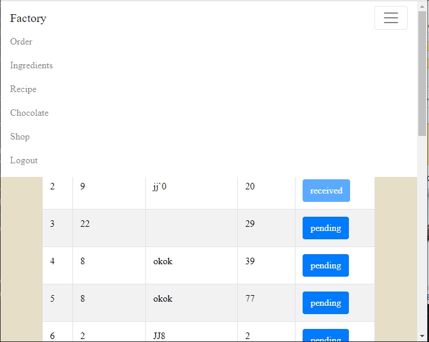

# Willy Wangky’s Factory

## Installation
1. Install Node and npm
2. Pull the repository
3. Enter the factory folder
4. Install the modules
```
npm install
```
5. Run
```
npm start
```
## Deskripsi Aplikasi
Willy Wangky's Factory merupakan sebuah aplikasi web manajemen pabrik coklat. Aplikasi ini menyediakan antarmuka untuk mengatur segala operasi yang berkaitan dengan pabrik. Aplikasi ini dibangun dengan ReactJs. Untuk mengakses aplikasi ini, perlu melakukan login untuk mengakses semua fitur yang tersedia. Setelah penggunaan selesai, pengguna dapat melakukan logout.

## Screenshot aplikasi
#### Login Page


#### Order List Page


#### Ingridient List Page


#### Recipe List Page


#### Coklat Stock Page


#### Shop Page


#### Small Window View
